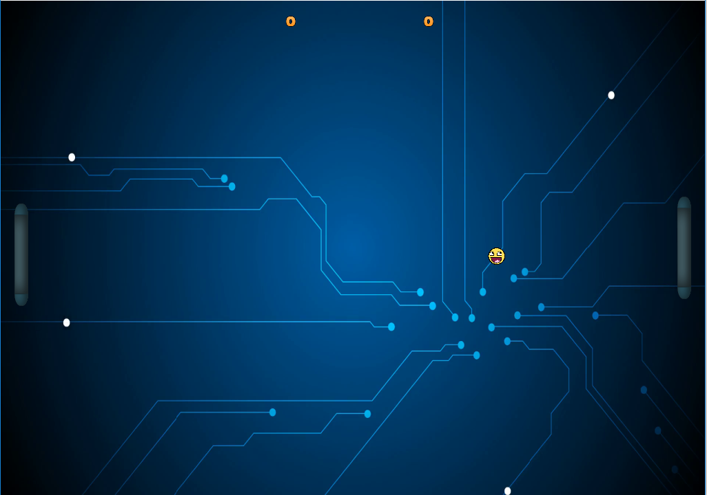

# PongOpenGL

Implementação do jogo pong em openGL  
Trabalho desenvolvido para a disciplina de Computaço Grafica

Projeto base do https://learnopengl.com/ e biblioteca de audio https://www.ambiera.com/irrklang/downloads.html (versão 1.5)  
Executavel na pasta PONG GAME    

